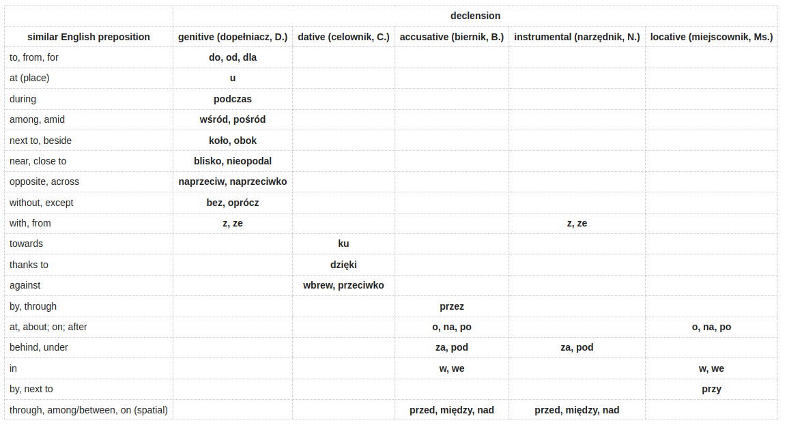

|                                      |        declension         |                       |                          |                              |                             |
|--------------------------------------|---------------------------|-----------------------|--------------------------|------------------------------|-----------------------------|
|     similar English preposition      | genitive (dopełniacz, D.) | dative (celownik, C.) | accusative (biernik, B.) | instrumental (narzędnik, N.) | locative (miejscownik, Ms.) |
|            to, from, for             |        do, od, dla        |                       |                          |                              |                             |
|              at (place)              |             u             |                       |                          |                              |                             |
|                during                |          podczas          |                       |                          |                              |                             |
|             among, amid              |       wśród, pośród       |                       |                          |                              |                             |
|           next to, beside            |        koło, obok         |                       |                          |                              |                             |
|            near, close to            |     blisko, nieopodal     |                       |                          |                              |                             |
|           opposite, across           |  naprzeciw, naprzeciwko   |                       |                          |                              |                             |
|           without, except            |        bez, oprócz        |                       |                          |                              |                             |
|              with, from              |           z, ze           |                       |                          |            z, ze             |                             |
|               towards                |                           |          ku           |                          |                              |                             |
|              thanks to               |                           |        dzięki         |                          |                              |                             |
|               against                |                           |   wbrew, przeciwko    |                          |                              |                             |
|             by, through              |                           |                       |          przez           |                              |                             |
|         at, about; on; after         |                           |                       |        o, na, po         |                              |          o, na, po          |
|            behind, under             |                           |                       |         za, pod          |           za, pod            |                             |
|                  in                  |                           |                       |          w, we           |                              |            w, we            |
|             by, next to              |                           |                       |                          |                              |            przy             |
| through, among/between, on (spatial) |                           |                       |    przed, między, nad    |      przed, między, nad      |                             |

